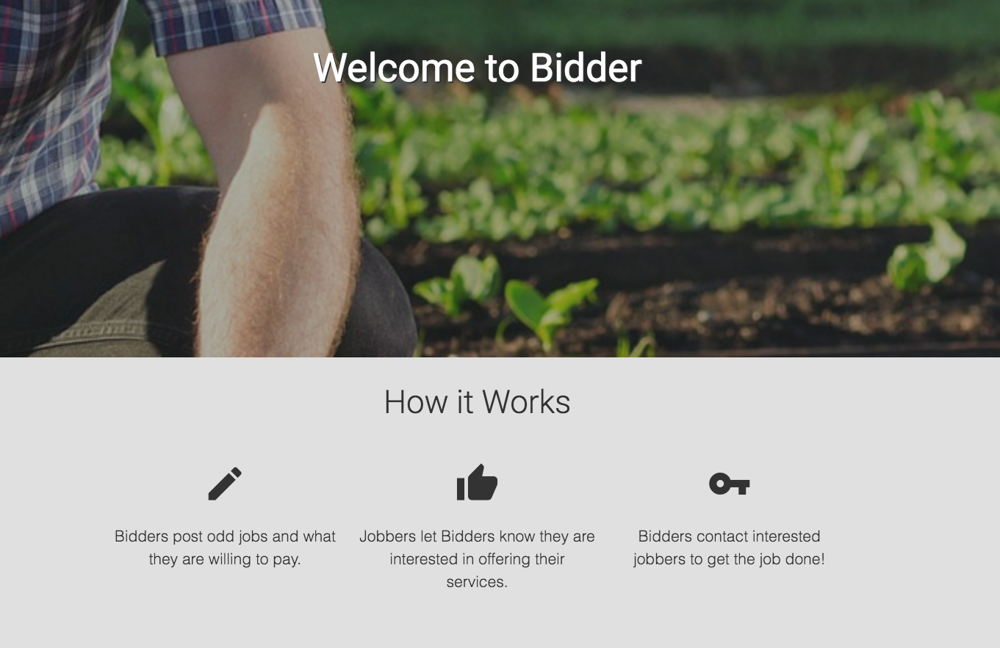

# Bidder

##Epicodus JavaScript Group Project

#### By Jackson Cafazzo, Jordan Meier, Daren Schaad, Lindsey Raffa
##### With special thanks to the first Bidder team: Jessica Fix, Jackson Cafazzo, Brooke Hurford, Taylor Pokoj

### Description

Bidder is a website that connects people looking for someone to perform an odd job with those offering their skills nearby. Bidders can post a job, or offer services. Bidder is geared towards those looking for independent contracts to complete tasks large or small, for fair pay.

This is the second incarnation of Bidder, where we further developed the app, bringing it closer to a production level web app where data is stored, users can create profiles and user authentication exists through social networking sites.

### Known Bugs

* Sometimes when a user logs in, it will show many profile links in the navbar until the page is refreshed.
* 

## Prerequisites

You will need the following things properly installed on your computer.

* [Git](http://git-scm.com/)
* [Node.js](http://nodejs.org/) (with NPM)
* [Bower](http://bower.io/)
* [Ember CLI](http://www.ember-cli.com/)
* [PhantomJS](http://phantomjs.org/)

## Installation

* `git clone <repository-url>` this repository
* change into the new directory
* `npm install`
* `bower install`

## Running / Development

* `ember server`
* Visit your app at [http://localhost:4200](http://localhost:4200).

### Technologies Used
* HTML
* CSS
* Sass
* Git
* JavaScript
* Ember.js
* Firebase/emberfire
* Bower
* NPM
* Moment
* Materialize
* Google Maps application
* Torii

###Copyright & Licensing

Copyright (c) 2015 **Jackson Cafazzo, Jordan Meier, Daren Schaad, Lindsey Raffa**

*This software is licensed under the MIT license.*

Permission is hereby granted, free of charge, to any person obtaining a copy
of this software and associated documentation files (the "Software"), to deal
in the Software without restriction, including without limitation the rights
to use, copy, modify, merge, publish, distribute, sublicense, and/or sell
copies of the Software, and to permit persons to whom the Software is
furnished to do so, subject to the following conditions:

The above copyright notice and this permission notice shall be included in
all copies or substantial portions of the Software.

THE SOFTWARE IS PROVIDED "AS IS", WITHOUT WARRANTY OF ANY KIND, EXPRESS OR
IMPLIED, INCLUDING BUT NOT LIMITED TO THE WARRANTIES OF MERCHANTABILITY,
FITNESS FOR A PARTICULAR PURPOSE AND NONINFRINGEMENT. IN NO EVENT SHALL THE
AUTHORS OR COPYRIGHT HOLDERS BE LIABLE FOR ANY CLAIM, DAMAGES OR OTHER
LIABILITY, WHETHER IN AN ACTION OF CONTRACT, TORT OR OTHERWISE, ARISING FROM,
OUT OF OR IN CONNECTION WITH THE SOFTWARE OR THE USE OR OTHER DEALINGS IN
THE SOFTWARE.
